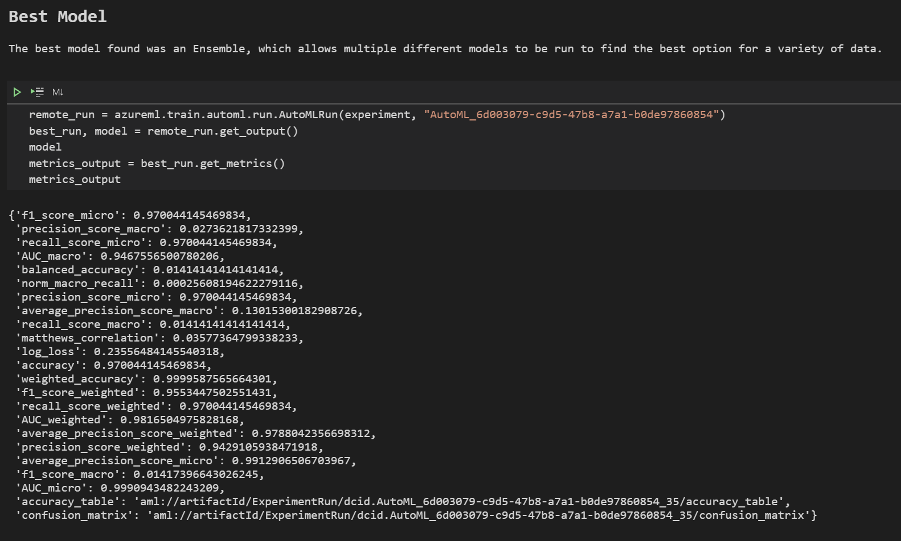
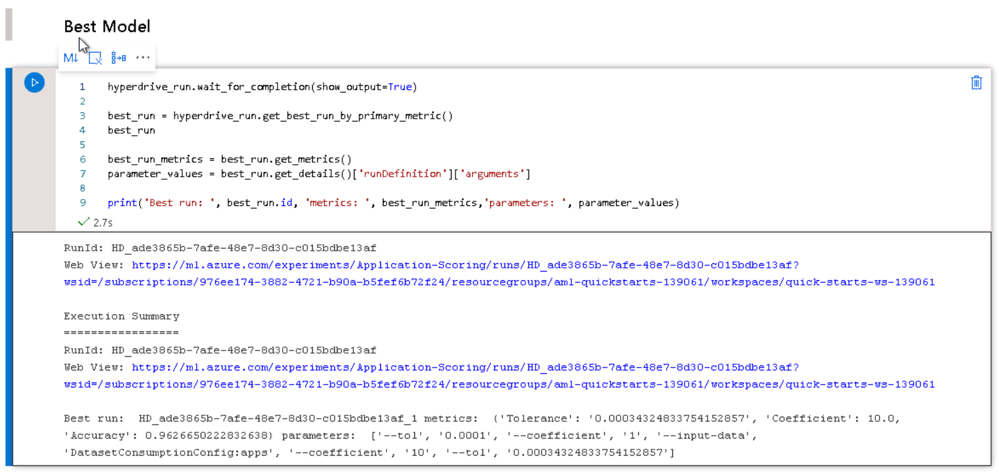

# Identifying the best potential applicants for a trucking company based on past length of employment

A major trucking company goes over thousands of applications per month.  These applications are tracked over time and are linked to a record that maintains employment status.  Taking the number of months of employment and trying to predict that value based on the input of the application may be able to identify key applications where the best recruiters should focus their time.  They currently have an AI model processing the data, but don't fully trust the results.  The data is NOT publicly available, but a limited amount was given to perform an analysis to determine what model or features might be relevant to the hiring process.  I pulled the data myself from a project that I am currently working on and so it cannot be externally verified, nor can the exact company be named.  The features here are derived from the data collected during the application process.  All personally identifiable information has been removed.  An unique identifier is included, but should be ignored for processing purposes.  The features include such things as the amount of previous truck driving experience and whether they currently have a Commercial Driver's License.

Using Azure AutoML and HyperParameter tuning a model can be developed that will be able to be applied to future applications to help the recruiter team focus its efforts on those that are most likely to be hired and work for the company longer.  Each application submitted will then be scored by the model that can best predict the most likely outcome to prioritize the work.  This will not be completely accurate, but as there are many applicants, prioritizing higher value applicants will help generate more revenue for the recruitment effort.

## Project Set Up and Installation
The dataset needed to be created from several tables kept within a database to join the data provided on the application with the employment dates.  The data of hire was subtracted from the current date if they are still employed, or from the last date of employment if they are not currently employed.  The data then was uploaded in csv format to an Azure ML workspace for further analysis.

## Dataset
The dataset does not include any personally identfying information.  Zip Code is provided as well as a fico score and responses to questions on driving history and driver license status.  As the exact method of accessing or uploading the data is not important, this dataset will not be publicly available after this project is complete.  The data was originally created as a sql query to gether data.  It was exported to Excel and then saved as a csv file.  I uploaded it to Google Drive at a link currently accessible.  As I found issues with some of the fields for processing on the hyperparameter side I found that the tools provided through Azure Pipelines were useful to fill in missing feature values and convert feature values to more standard labels.  The data was processed into blob storage, downloaded as a csv and then uploaded again as a new version to Google Drive.  After the data has been imported once as a dataset, the code will look for the properly named dataset which processes several minutes faster when the code reaches that point.

### Overview
The dataset is from a major trucking company. severa tables were joined together to provide a consistent dataset.  The data is fairly lopsided as most applications are not hired, so a majority of the data has zero months of employment.

### Task
Identifying the applications that will give the highest return on investment is important as recruiting is a huge cost.  Turnover is fairly high as well.  Identifying an applicant that will continue to work for the company over time can help to optimize the investment in recruiting.  Using joined information that provides how long past applicants have worked for the company, along with the data supplied for the application can help identify the best applicants.

### Access
The dataset was uploaded to the machine learning workspace as part of the initial set up and analysis.  The dataset is not publicly available and will not be made available to others.

## Automated ML
I tried several different methods of data analysis to try and determine the best settings.  As the number of months is a number, a regression seemed the most logical initially, but that provided very low accuracy, so a Classification type was chosen to bucket the information.  The correlation coefficient was fairly low for regression however.  I also identified several factors that may have just been random chance and removed them from analysis, such as an application identification number.  I also removed columns that were scoring from other models as this model may replace those items.  As there is a lot of data, enabling early stopping is critical.  The criteria to maximize in this case was the AUC_weighted, which helps deal sparse data by weighting the data and fitting the data under the standard bell curve.  The Max Concurrent Iterations is limited to 4 as more nodes cannot be activated, and the experiment timeout ensures that something will be returned in a reasonable amount of time.

### Results
Azure AutoML found that a VotingEnsemble collaboration of models was the best model.  The model uses 6 different other models underneath with a weight.  LightGBM with a weight of 53% will be the most trusted piece, followed by two XGBoostClassifier models with 13% each.  Three other at about 7% each with 2 other XGBoostClassifiers and 1 Random Forest.
The following properties are in the model:
        "ensembled_algorithms": "['XGBoostClassifier', 'XGBoostClassifier', 'LightGBM', 'XGBoostClassifier', 'XGBoostClassifier', 'RandomForest']",
        "ensemble_weights": "[0.13333333333333333, 0.13333333333333333, 0.5333333333333333, 0.06666666666666667, 0.06666666666666667, 0.06666666666666667]",
        "best_individual_pipeline_score": "0.9802816408800817",
        "best_individual_iteration": "1", 
The model metrics returned are:
    Accuracy 0.97004
    AUC macro 0.94676
    AUC micro 0.99909
    AUC weighted 0.98165

The Run Details Widget in Action:


The best model output parameters:


## Hyperparameter Tuning
I attempted to use SVC originally, but with the data size it ended up running for a longer time that is possible to finish the project.  I learned that linear_SVC has a much quicker time.  I also found that scaling the data can make a big performance difference, so I made certain to scale the data before trying to fit the model.  Linear SVC has a tolerance parameter which decideds how quickly the model is stopped and a C Regularization parameters.  The tolerance range will be randomly chosen between 0.00005 and 0.0005, which will determine how quickly the model stops.  The C Regularization will randomly choose from the following options: 0.001,0.01, 0.1, 1, 10 Which are spread out to give meaningful differences in regularization.  Max iterations was also adjusted to allow more time to find the proper model fit.


### Results
Model accuracy ranged quite a bit, from 56% to 96% depending on the parameters.  The best model results were returned using a high coefficient, which was always the biggest factor, and a higher tolerance seemed to also push the accuracy up.  The best model tested used a 10 as the C coefficient and a tolerance of 0.00034.  The model may be able to be adjusted slightly better by adjusting the max number of iterations and focusing more on higher C and tolerance values. An accuracy of 96.4% seemed to be the highest achieved.

The Details widget in action:


The best model output parameters:

## Model Deployment
The model that I deployed was the AzureML model.  It had better accuracy by a bit, but also handled the sparse data better for AUC fit. I was able to deploy the model using python that finds the best child run of the AutoML run.  Using the run object I registered the model with the Azure workspace.  As this used a custom dataset I provided a custom score script that was slightly modified version of the script supplied by Microsoft when automatically deployed through the ui.  I did hit some errors when it was originally deployed, and used the logging output to correct the endpoint script that was run. As this was run within Azure AutoML I cloned a standard environment to be able to deploy the script with an Inference Configuration.  The model was then deployed to an Azure Container Instance and queried. 

## Query the model
The following code will allow querying the endpoint, as long as the scoring_uri and key are updated as necessary after deploying the endpoint.  Sample data is included which would return a result of zero.
```
import json
from collections import namedtuple
import pandas as pd
#dataString = dataset.take(1).to_pandas_dataframe().to_json()
#service = azureml.core.Webservice(ws,'best-model-service-309')
scoring_uri = 'http://9e6421ff-e5b4-4a6a-9b1e-da3eb5b91ff8.westus.azurecontainer.io/score'
# If the service is authenticated, set the key or token
key = '8b9M2mxheVcli4xUjlkKUy6hM9Lz8hQD'

data = [
        {"app.cre_AppId":4054803,
        "app.cre_Experience":0.0,
        "app.cre_MonthsExperienceinPast36":0.0,
        "app.cre_PardotScore":"object",
        "app.cre_Veteran":171140000,
        "app.cre_WantTeamDriver":0,
        "app.cre_DriverApplicationSource":"object",
        "app.cre_RecordSource":"{F13D1BBF-06FE-E611-80DA-0050569526E6}",
        "app.cre_CDLType":171140000,
        "app.cre_AccidentInformationProvided":False,
        "app.cre_ContactInformationProvided":False,
        "app.cre_CriminalInformationProvided":False,
        "app.cre_TicketInformationProvided":False,
        "app.cre_ScoreCurrent":2.0,
        "app.cre_ScoreInitial":4,
        "app.cre_VettingStatus":171140002,
        "app.cre_AccidentCount":0,
        "app.cre_DUICount":0,
        "app.cre_MovingViolationCount":0,
        "app.cre_SoftFicoScore":0,
        "app.cre_CDLCLPExp":"object",
        "app.cre_FelonyCount":0,
        "address1_postalcode":45011,
        "cre_referralcode":"object",
        "cre_referralestimatedexperience":0,
        "cre_referralsourceid":"object",
        "cre_accidentcount":0,
        "cre_canpassdrugtest":"true",
        "cre_cdlclass":"object",
        "cre_cdlexp":0,
        "cre_duicount":"example_value",
        "cre_hascdl":"false",
        "cre_honorablydischarged":"object",
        "cre_movingviolationcount":0,
        "cre_recordsource":7088,
        "cre_veteran":"false",
        "cre_washonorablydischarged":1,
        "cre_minsoftficoscore":"example_value",
        "cre_softficoscore":"example_value",
        "cre_militarydischargedon":"2000-1-1",
        "cre_recklessdrivingcount":0,
        "cre_driverchewtobacco":0,
        "cre_driversmoker":0,
        "cre_drivervapeuser":0,
        "cre_teamchewtobaccousers":0,
        "cre_teamoppositegender":"example_value",
        "cre_teamsmokers":0,
        "cre_teamvapeusers":0,
        "cre_teamgender":0,
        "cre_donottext":True}
    ]
input_payload = json.dumps({
    'data': data
})
print(input_payload)
with open("data.json", "w") as _f:
    _f.write(input_data)

# Set the content type
headers = {'Content-Type': 'application/json'}
# If authentication is enabled, set the authorization header
headers['Authorization'] = f'Bearer {key}'

# Make the request and display the response
resp = requests.post(scoring_uri, input_data, headers=headers)
print(resp.json())
```

## Screen Recording
The following screen cast shows the model being deployed and run from a notebook.

[](https://youtu.be/OqJ13ncPTAQ)

## Future Improvements
In the future I will better prepare the data to be ingested, and remove duplicate features, as there is some data that has a number value and a text value that both mean the same thing.  This could be applied specifically to the AutoML side.  After a good model has been found, more precise tuning could then be attempted using Hyperparamter search on that particular model, although that could be a fairly time consuming process to really get a model that is better than AutoML could provide.  Also the time limit could be extended to allow more time to find the optimal model using deep learning.

## Standout Suggestions
 I tried to run some calculations on the custom hyperparameter model to provide AUC as well, but it was taking multiple days to run the suggested code.  If there was more time it might be possible to get a better model with manual model choices, but the amount of time required to gather the information and run the models is orders of time longer.  What I can accomplish using AutoML within a week is quite amazing.  I did learn quite a bit about data cleaning and scaling that I could apply to make the AutoML runs even better while researching how to run the hyperparameter model.
