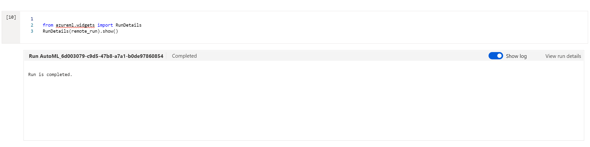
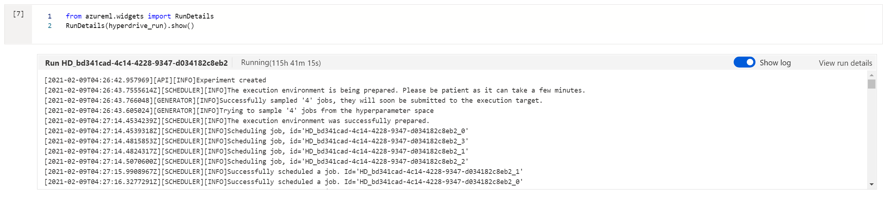

# Identifying the best potential applicants for a trucking company based on past length of employment

A major trucking company goes over thousands of applications per month.  These applications are tracked over time and are linked to a record that maintains employment status.  Taking the number of months of employment and trying to predict that value based on the input of the application may be able to identify key applications where the best recruiters should focus their time.  They currently have an AI model processing the data, but don't fully trust the results.

## Project Set Up and Installation
The dataset needed to be created from several tables kept within a database to join the data provided on the application with the employment dates.  The data of hire was subtracted from the current date if they are still employed, or from the last date of employment if they are not currently employed.  The data then was uploaded in csv format to an Azure ML workspace for further analysis.

## Dataset
The dataset does not include any personally identfying information.  Zip Code is provided as well as a fico score and responses to questions on driving history and driver license status.

### Overview
The dataset is from a major trucking company. severa tables were joined together to provide a consistent dataset.  The data is fairly lopsided as most applications are not hired, so a majority of the data has zero months of employment.

### Task
Identifying the applications that will give the highest return on investment is important as recruiting is a huge cost.  Turnover is fairly high as well.  Identifying an applicant that will continue to work for the company over time can help to optimize the investment in recruiting.  Using joined information that provides how long past applicants have worked for the company, along with the data supplied for the application can help identify the best applicants.

### Access
The dataset was uploaded to the machine learning workspace as part of the initial set up and analysis.  The dataset is not publicly available and will not be made available to others.

## Automated ML
I tried several different methods of data analysis to try and determine the best settings.  As the number of months is a number, a regression seemed the most logical initially.  The correlation coefficient was fairly low for regression however.  I also identified several factors that may have just been random chance and removed them from analysis, such as an application identification number.  I also removed columns that were scoring from other models

### Results
Using a categorization model targeting the weighted Area Under the Curve gave a final value of 98.6 and Accuracy of 97.4%

## Hyperparameter Tuning
I attempted to use SVC originally, but with the data size it ended up running for a longer time that is possible to finish the project.  I learned that linear_SVC has a much quicker time.  I also found that scaling the data can make a big performance difference, so I made certain to scale the data before trying to fit the model.  Linear SVC has a tolerance parameter which decideds how quickly the model is stopped and a C Regularization parameters.  Max iterations was also adjusted to allow more time to find the proper model fit.

### Results
Model accuracy ranged quite a bit, from 56% to 96% depending on the parameters

## Model Deployment
The model that I deployed was the AzureML model.  It had better accuracy by a bit, but also handled the sparse data better for AUC fit. 

## Screen Recording
The following screen cast shows the model being deployed and run from a notebook.

## Standout Suggestions
 I tried to run some calculations on the custom hyperparameter model to provide AUC as well, but it was taking multiple days to run the suggested code.  If there was more time it might be possible to get a better model with manual model choices, but the amount of time required to gather the information and run the models is orders of time longer.  What I can accomplish using AutoML within a week is quite amazing.  I did learn quite a bit about data cleaning and scaling that I could apply to make the AutoML runs even better while researching how to run the hyperparameter model.
